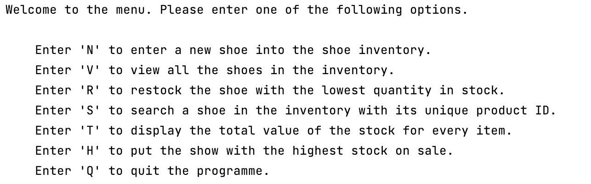

# Shoe-Store-Backend
## Shoe store storage backend 

This project is the backend logic, written in Python, for a hypothetical shoe store. 
It allows users to add, remove, update, order replacements, and search for shoes.

### How to install
1. Download the code from Github and paste to a Python IDE or clone it:
> git clone https://github.com/ThomasAlberto/Shoe-Store-Backend.git
2. Install dependencies
> pip install tabulate
3. Run the programme.

_Once you run the programme, your run terminal should look like this:_

_Simply enter the letter you are prompted with on the virtual menu._